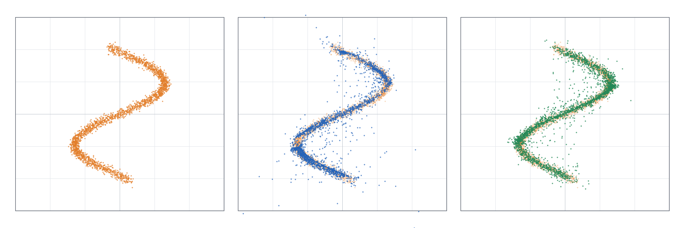
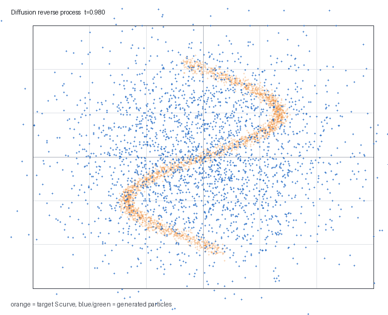
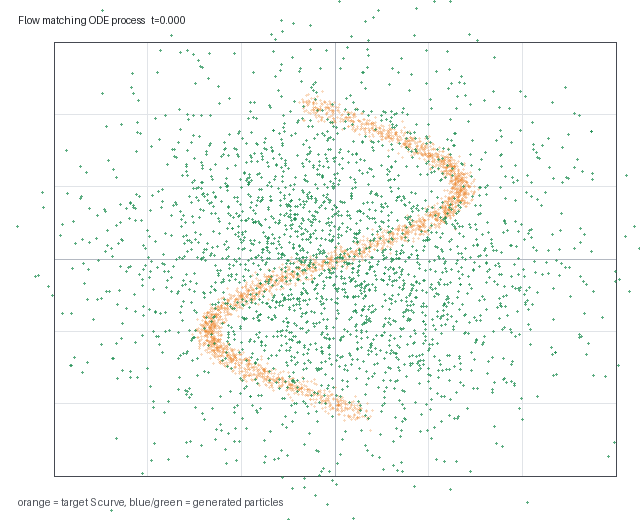
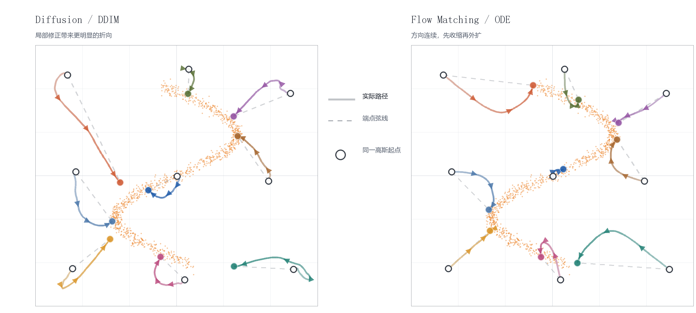
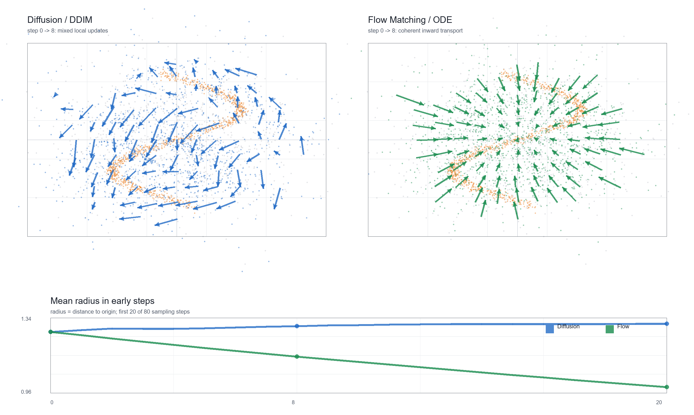
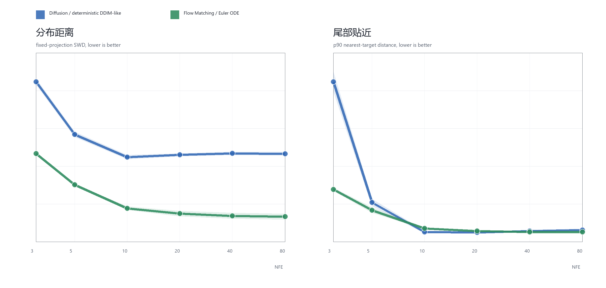
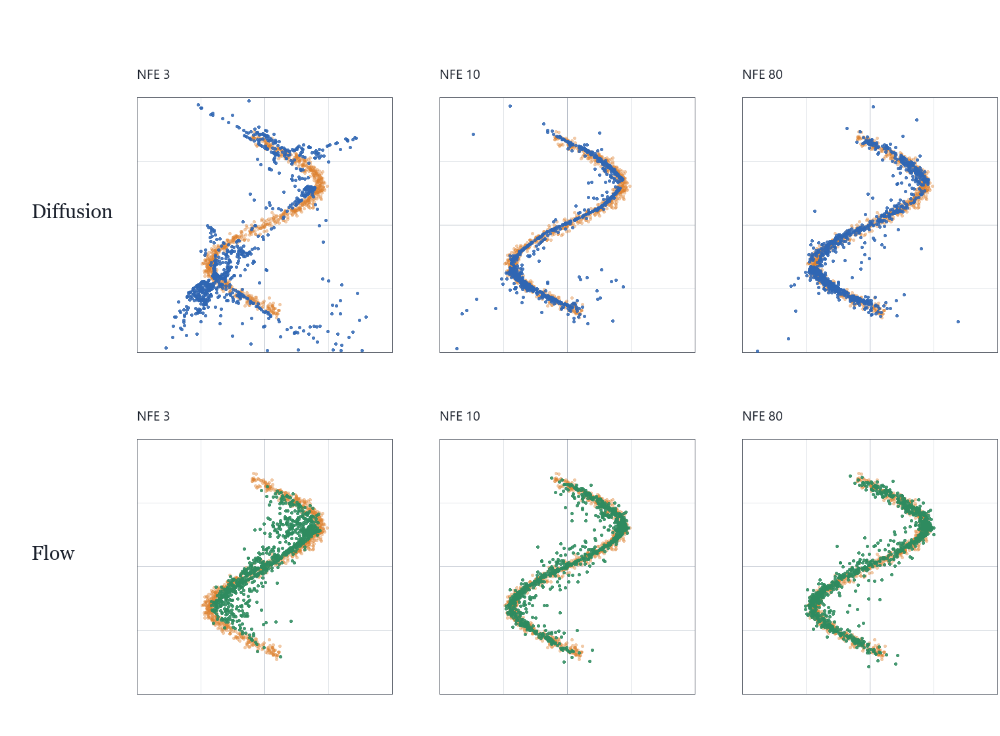

# 2D S-curve 生成实验：Diffusion 与 Flow Matching

本仓库实现一个二维生成任务：从二维标准高斯分布出发，生成 S 形目标分布，并比较 Diffusion 与 Flow Matching 在终态分布、样本轨迹、局部速度场和采样预算上的差异。

代码使用 `numpy` 手写 MLP、反向传播和 Adam，不依赖 PyTorch 或 Conda。

## 内容

```text
scurve_diffusion_flow.py       实验主程序
requirements.txt               Python 依赖
analysis.md                    实验分析记录
presentation/index.html        HTML 幻灯片入口
presentation/diffusion-flow-scurve.pdf
                                PDF 版幻灯片
presentation/slides/           单页 HTML
presentation/assets/           实验图像、GIF 与图表
```

## 运行

```powershell
python -m pip install -r requirements.txt
python .\scurve_diffusion_flow.py
```

快速检查：

```powershell
python .\scurve_diffusion_flow.py --quick --out outputs_quick
```

默认输出在 `outputs/` 中，包括两种采样过程 GIF、最终分布对比图、指标文件和样本文件。

## 实验结果

最终分布对比：



采样动态过程：

| Diffusion / DDIM | Flow Matching / ODE |
| --- | --- |
|  |  |

样本轨迹与早期动力：





采样预算对比：





## 幻灯片

- HTML 版：`presentation/index.html`
- PDF 版：`presentation/diffusion-flow-scurve.pdf`

HTML 版依赖相对路径加载图片、公式和单页文件，查看时保持 `presentation/` 目录结构不变即可。

## 方法概要

目标分布是二维 S 曲线：

```text
u ~ Uniform(-2.05, 2.05)
x = 1.15 sin(1.65u) + noise
y = 0.82u + noise
```

源分布是二维标准高斯 `N(0, I)`。

Diffusion 训练时构造带噪样本：

```text
xt = alpha(t) x0 + sigma(t) eps
alpha(t) = cos(pi t / 2)
sigma(t) = sin(pi t / 2)
eps ~ N(0, I)
L = E || eps_theta(xt, t) - eps ||^2
```

采样时使用确定性的 DDIM-like 更新：

```text
x0_hat = (xt - sigma(t) eps_theta(xt,t)) / alpha(t)
x_{t_next} = alpha(t_next) x0_hat + sigma(t_next) eps_theta(xt,t)
```

Flow Matching 训练时构造线性概率路径并回归速度：

```text
zt = (1 - t) z0 + t x1
u_t = x1 - z0
L = E || v_theta(zt,t) - (x1 - z0) ||^2
```

采样时求解 ODE：

```text
dx / dt = v_theta(x,t),  x(0) ~ N(0,I)
```

## 指标

- `sliced_wasserstein`：切片 Wasserstein 距离，越低表示生成分布越接近目标分布。
- `sample_seconds`：采样耗时。
- `nfe`：神经网络前向调用次数，可近似理解为采样计算预算。

本实验只支持当前二维任务、当前网络容量和当前采样器下的比较，不构成对两类方法的一般排序。
